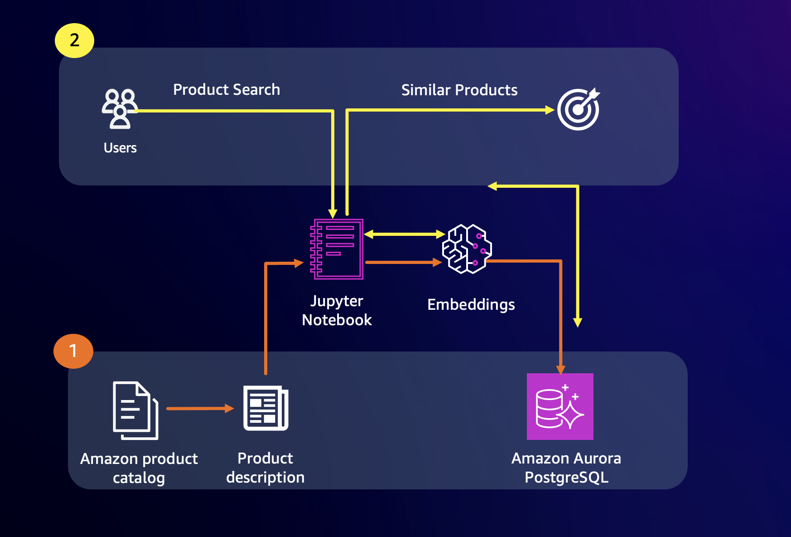

# Product Recommendations with pgvector

This lab demonstrates two approaches for product similarity search and recommendations with Aurora PostgreSQL and pgvector.

## Architecture



## Notebooks

1. `opensource-similarity-search.ipynb`
   - Deploys Hugging Face `sentence-transformers/all-MiniLM-L6-v2` on SageMaker.
   - Generates 384-dimensional embeddings for the FEIDEGGER product image-description dataset.
   - Stores vectors in Aurora PostgreSQL and searches with pgvector (IVFFlat + L2).

2. `bedrock-similarity-search.ipynb`
   - Uses Amazon Bedrock Titan Embeddings V2 (`amazon.titan-embed-text-v2:0`).
   - Generates 1024-dimensional product-description embeddings.
   - Loads the Amazon product catalog from `data/amazon.csv`.
   - Creates an HNSW index and runs semantic product discovery queries.

## Prerequisites

### AWS Account Access

- An AWS account with SageMaker execution role for the open-source notebook.
- Amazon Bedrock model access for the Bedrock notebook (see below).

### Enable Bedrock Model Access

Before running `bedrock-similarity-search.ipynb`, enable **Titan Text Embeddings V2** in the
Amazon Bedrock console:

1. Open the [Amazon Bedrock console](https://console.aws.amazon.com/bedrock/).
2. In the left navigation pane, choose **Model access**.
3. Find **Amazon Titan Text Embeddings V2** and choose **Manage model access**.
4. Select the checkbox next to the model and choose **Save changes**.

Model ID used by the notebook: `amazon.titan-embed-text-v2:0`
Override with env var: `export BEDROCK_MODEL_ID=amazon.titan-embed-text-v2:0`

### Create the Database Secret

Both notebooks retrieve Aurora PostgreSQL credentials from AWS Secrets Manager using the secret
name `apgpg-pgvector-secret`. The secret must contain the keys `username`, `password`, `host`,
and `port`.

Create it with the AWS CLI (replace placeholder values):

```bash
aws secretsmanager create-secret \
  --name apgpg-pgvector-secret \
  --description "Aurora PostgreSQL credentials for pgvector workshop" \
  --secret-string '{
    "username": "postgres",
    "password": "YOUR_PASSWORD",
    "host": "YOUR_CLUSTER_ENDPOINT",
    "port": "5432"
  }' \
  --region "${AWS_REGION:-us-west-2}"
```

### Aurora PostgreSQL with pgvector

You need an Aurora PostgreSQL cluster with the pgvector extension enabled:

```sql
CREATE EXTENSION IF NOT EXISTS vector;
```

## Setup

Install the notebook dependencies:

```bash
python3.11 -m venv env
source env/bin/activate

# For the Bedrock notebook:
pip install -r requirements.txt

# For the open-source SageMaker notebook:
pip install -r opensource_requirements.txt
```

## Why Two Different Indexes?

The two notebooks intentionally demonstrate different pgvector index strategies to highlight the
trade-offs:

| Notebook | Index Type | Distance Metric | Use Case |
|----------|-----------|-----------------|----------|
| `bedrock-similarity-search.ipynb` | HNSW | Cosine (`<=>`) | General-purpose semantic text search; normalized embeddings from Titan V2 make cosine the natural metric. HNSW gives high recall with low query latency and does not require a training step. |
| `opensource-similarity-search.ipynb` | IVFFlat | L2 (`<->`) | Demonstrates the classic pgvector workflow; MiniLM embeddings are not normalized by default, so Euclidean distance is a reasonable choice. IVFFlat is simpler to reason about but requires the `lists` parameter to be tuned to the dataset size. |

For new workloads, prefer HNSW + cosine when using normalized embeddings (such as those from
Bedrock Titan or Cohere). Use IVFFlat when memory is constrained or when migrating from an
existing cosine-or-L2 workflow.

## Notes

- Embeddings: `amazon.titan-embed-text-v2:0` produces 1024-dimensional vectors. All vector
  columns in the Bedrock notebook use `vector(1024)`.
- The open-source notebook uses MiniLM 384-dimensional embeddings (`vector(384)`).
- Keep the table schema aligned with the notebook you run.
