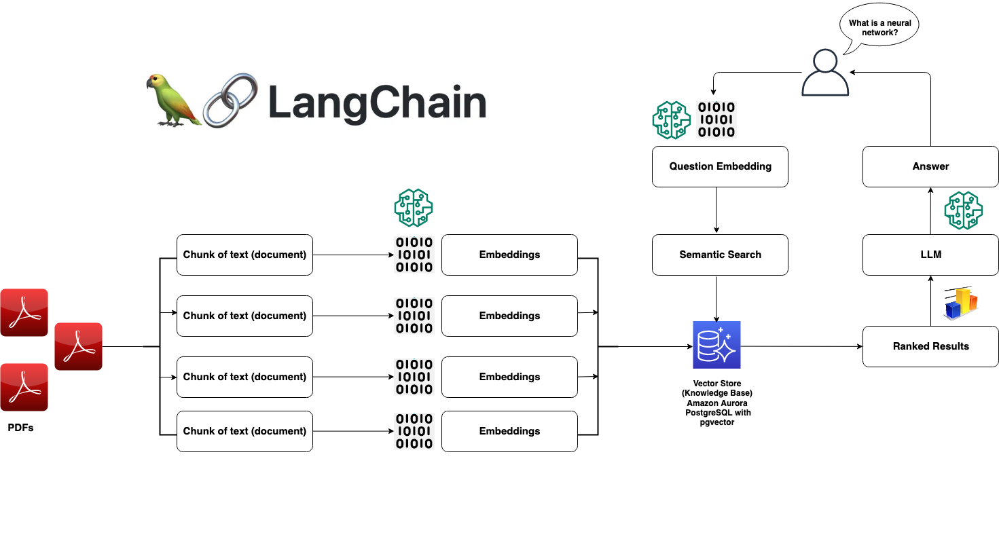

# Intelligent Document Question-Answering (Open-Source Stack)

A RAG application using Hugging Face embeddings and an open-source LLM, backed by Aurora PostgreSQL with pgvector.

## Overview

- Hugging Face `sentence-transformers/all-mpnet-base-v2` for embeddings (via InstructorEmbeddings)
- `MBZUAI/LaMini-Flan-T5-783M` from Hugging Face Hub for answer generation
- Aurora PostgreSQL with pgvector for vector storage
- LangChain for the retrieval pipeline
- Streamlit for the user interface

## Architecture



## Prerequisites

- Python 3.9 or higher
- A Hugging Face account with an API token
- An Amazon Aurora PostgreSQL cluster with the `vector` extension installed

## Installation

1. Clone the repository and navigate to this directory:
   ```bash
   git clone https://github.com/aws-samples/aurora-postgresql-pgvector.git
   cd aurora-postgresql-pgvector/03-retrieval-augmented-generation/question-answering-opensource

   python3.11 -m venv env
   source env/bin/activate
   ```

2. Install dependencies:
   ```bash
   pip install -r requirements.txt
   ```

3. Configure environment variables:
   ```bash
   cp env.example .env
   # Edit .env and fill in your values
   ```

   Key variables (the app accepts both `PG*` and `PGVECTOR_*` prefixes):
   ```
   HUGGINGFACEHUB_API_TOKEN=<your-api-token>

   PGVECTOR_USER=<username>
   PGVECTOR_PASSWORD=<password>
   PGVECTOR_HOST=<aurora-cluster-endpoint>
   PGVECTOR_PORT=5432
   PGVECTOR_DATABASE=<database-name>
   ```

## Database Setup

```sql
CREATE EXTENSION IF NOT EXISTS vector;
```

## Running the Application

```bash
streamlit run app.py
```

Upload PDF documents, click Process, then ask questions.

## Troubleshooting

### Token Dimension Mismatch

If you see an error about vector dimension mismatch (e.g. `expected 768, got 1536`), this means the embeddings stored in the database were generated by a different model than the one currently configured. Drop and recreate the `langchain_pg_embedding` table after switching models:

```sql
DROP TABLE IF EXISTS langchain_pg_embedding;
```

Then re-upload your documents to regenerate embeddings with the current model.

## License

[MIT-0 License](https://spdx.org/licenses/MIT-0.html)
