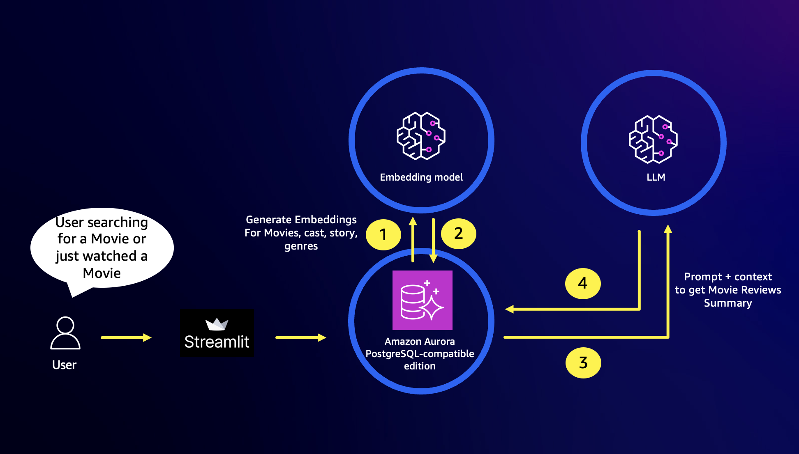
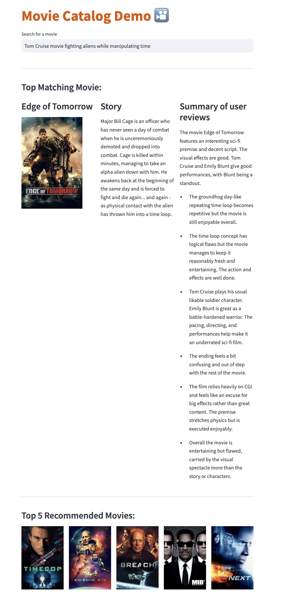

# 🎬 Intelligent Movie Recommendations System

This enterprise-ready recommendation system combines Amazon Aurora PostgreSQL with powerful AWS AI services to deliver personalized movie suggestions. Our solution leverages Amazon Bedrock's Titan Text for embeddings and Anthropic's Claude for natural language processing, while using Aurora ML to generate embeddings directly within the database context.

## 🎯 Key Components

We integrate several AWS services to create an efficient recommendation engine:

- **Amazon Bedrock**: Powers our AI capabilities through foundation models
- **Aurora PostgreSQL + pgvector**: Stores and processes vector embeddings
- **Aurora ML**: Generates embeddings directly in the database using Bedrock
- **Titan Text**: Creates text embeddings for movie content
- **Claude**: Provides natural language understanding capabilities

## 🏗️ Architecture



## 🔄 System Workflow

Our system processes and recommends movies through these key steps:

1. **Data Initialization**: Uses TMDB API data to populate movie details, cast information, and reviews in the PostgreSQL database.

2. **Embedding Generation**: Creates vector representations of movies using `aws_bedrock.invoke_model_get_embeddings`, storing them in vector columns for efficient similarity search.

3. **Recommendation Engine**: Provides suggestions based on:
   - Movie content similarity (cast, genre, overview)
   - Collaborative filtering from user watch patterns

4. **Review Analysis**: Generates concise summaries of movie reviews using `aws_bedrock.invoke_model`.

## 🚀 Setup Guide

### Prerequisites

**Amazon Bedrock model access** — enable the following models in the Bedrock console (us-west-2 or your target region):
- **Amazon Titan Embeddings V2** (`amazon.titan-embed-text-v2:0`) — used for all vector embeddings
- **Anthropic Claude Sonnet 5** (`global.anthropic.claude-sonnet-5`) — used for review summaries; `global.anthropic.claude-sonnet-5` is also available as an override

**Aurora ML — IAM role for Bedrock** — your Aurora cluster must have an IAM role with `bedrock:InvokeModel` attached via the Bedrock feature:

```bash
# 1. Create or reuse a role with the AmazonBedrockFullAccess policy (or a least-privilege inline policy)
# 2. Attach it to the cluster
aws rds add-role-to-db-cluster \
  --db-cluster-identifier <your-cluster-id> \
  --role-arn arn:aws:iam::<account-id>:role/<your-bedrock-role> \
  --feature-name Bedrock \
  --region ${AWS_REGION:-us-west-2}
```

See the [Aurora ML setup guide](https://docs.aws.amazon.com/AmazonRDS/latest/AuroraUserGuide/postgresql-ml.html#postgresql-ml-setting-up-apg-br) for full details.

**Other requirements:**
- Aurora PostgreSQL cluster (Aurora PostgreSQL 18.3 recommended)
- Python 3.11+

### Installation Steps

1. Clone and setup environment:
```bash
git clone https://github.com/aws-samples/aurora-postgresql-pgvector.git
cd aurora-postgresql-pgvector/04-aurora-ml-movie-recommendations
python3.11 -m venv env
source env/bin/activate
```

2. Configure `.env` file:
```bash
DBUSER='username'
DBPASSWORD='password'
DBHOST='aurora-cluster-host'
DBPORT=5432
DBNAME='dbname'
```

3. Install dependencies:
```bash
pip install -r requirements.txt
```

### Database Setup

1. Enable required extensions:
```sql
CREATE EXTENSION vector;
CREATE EXTENSION aws_ml CASCADE;
```

2. Initialize database:
```bash
createdb moviedb
gunzip -c data/movies.sql.gz | psql -d moviedb
psql -d moviedb -f data/functions.sql
```

3. Add the embedding column and generate embeddings:
```sql
ALTER TABLE movie.movies ADD COLUMN movie_embedding vector(1024);
CALL movie.generate_movie_embeddings();
```

   > **Note:** If you previously ran this lab with Titan Embeddings V1 (1536-dim), you must drop the old column, recreate it as `vector(1024)`, and re-run `generate_movie_embeddings()` to regenerate all embeddings with Titan V2.

4. Create the HNSW index for fast cosine-distance search (run after embeddings are generated):
```sql
CREATE INDEX IF NOT EXISTS movies_embedding_hnsw_idx
    ON movie.movies
    USING hnsw (movie_embedding vector_cosine_ops);
```

## 💻 Running the Application

1. Launch the application:
```bash
streamlit run ./app.py --server.port 8080
```

2. Access the interface and start exploring movie recommendations.



## 🔍 Understanding Vector Embeddings

Our system creates 1024-dimensional vectors that capture movie characteristics including:
- Plot elements and themes
- Genre combinations
- Cast relationships
- User viewing patterns

These embeddings enable the system to understand complex relationships between movies and provide nuanced recommendations.

## 📚 Best Practices

For optimal performance:
- Regularly update movie data and embeddings
- Monitor embedding generation performance
- Index vector columns for faster similarity search
- Implement batch processing for large updates

## 📜 License

Released under the [MIT-0 License](https://spdx.org/licenses/MIT-0.html).
