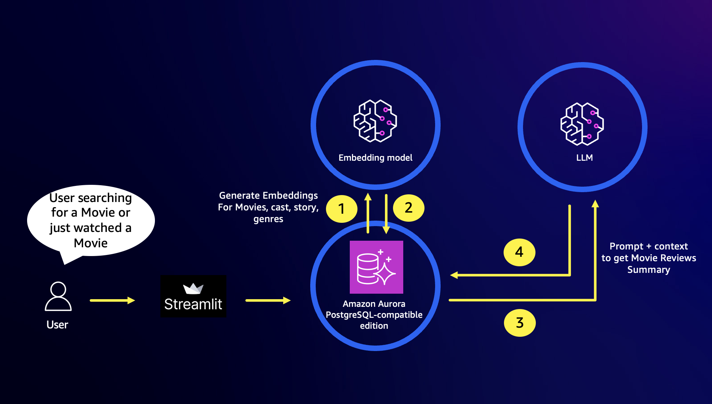

# Generative AI Use Cases with Amazon Aurora PostgreSQL ML (aws_ml), pgvector and Amazon Bedrock

## Introduction - Build and deploy an AI-powered Movie Recommendations Application

In this lab, we provide a step-by-step guide with all the building blocks for creating an enterprise ready RAG application such as a Movie Recommendations. We use a combination of different AWS services including [Amazon Bedrock](https://aws.amazon.com/bedrock/), an easy way to build and scale generative AI applications with foundation models. We use [Titan Text](https://aws.amazon.com/bedrock/titan/) for text embeddings and [Anthropic's Claude on Amazon Bedrock](https://aws.amazon.com/bedrock/claude/) as our LLM, the pgvector extension on Amazon Aurora PostgreSQL-Compatible Edition as our vector database and Aurora ML for generating embeddings by invoking Amazon Bedrock LLMs from database context. 

Aurora machine learning is an Aurora feature that lets builders work directly with AWS ML services using SQL commands, including Amazon Bedrock, Amazon SageMaker, and Amazon Comprehend. With recent support for Amazon Bedrock, Aurora ML gives you access to foundational models and embedding generators, helping reduce latency when working with data already stored in you Aurora cluster. This includes two new functions: [aws_bedrock.invoke_model](https://docs.aws.amazon.com/AmazonRDS/latest/AuroraUserGuide/postgresql-ml.html#postgresql-using-bedrock), which lets you use a foundational model from a SQL query, and [aws_bedrock.invoke_model_get_embeddings](https://docs.aws.amazon.com/AmazonRDS/latest/AuroraUserGuide/postgresql-ml.html#postgresql-using-bedrock), which lets you generate an embedding from a SQL query. For more information, see Using [Amazon Aurora machine learning with Aurora PostgreSQL](https://docs.aws.amazon.com/AmazonRDS/latest/AuroraUserGuide/postgresql-ml.html).

Please ensure that you have completed prerequisites as per the [documentation](https://docs.aws.amazon.com/AmazonRDS/latest/AuroraUserGuide/postgresql-ml.html#postgresql-ml-setting-up-apg-br).

## Architecture



## How It Works

The application follows these steps to provide responses to your questions:


1. **Movie data initilization**: The dataset was generated using [TMDB API](https://developer.themoviedb.org/reference/intro/getting-started). The script `pg-init.sql` consists the movies dataset, cast, and reviews. We use PostgreSQL native client utility `psql` to load data into Aurora PostgreSQL cluster. It will create a new database `moviesdb`, a new schema `movie` and set of tables - `movies`, `genres` and `reviews`.

2. **Embedding**: The function `aws_bedrock.invoke_model_get_embeddings` is used to generate embeddings from data that already exists in your database. The generated embeddings are stored in `movies.movie_embedding` and `movie.users_watched_embedding` vector columns.

3. **Movie Suggestions**: When the user watch a movie,
    1. the app compares the watched movie in the context of cast, genre and overview in `movies.movie_embedding` vector data and recommends related movies.
    2. the app also compares the watched movie in the context of other users who also watched the movie and performs recommendations.

4. **Reviews Summary**: The function `aws_bedrock.invoke_model` is used to generate summary of all the reviews for a given movie.

## Dependencies and Installation

To build the GenAI Q&A chatbot with pgvector and Amazon Aurora PostgreSQL, please follow these steps:

1. Clone the repository to your local machine.

2. Create a new [virtual environment](https://docs.python.org/3/library/venv.html#module-venv) and activate it.
```
python3.9 -m venv env
source env/bin/activate
```

3. Create a `.env` file in your project directory similar to `env.example` to add your HuggingFace access tokens and Aurora PostgreSQL DB cluster details. Your .env file should like the following:
   
```
DBDRIVER='psycopg2'
DBUSER='<<Username>>'
DBASSWORD='<<Password>>'
DBHOST='<<Aurora DB cluster host>>'
DBPORT=5432
DBNAME='<<DBName>>'
```

4. Install the required dependencies by running the following command:
```
pip install -r requirements.txt
```

## Usage

To use the GenAI Q&A with pgvector and Amazon Aurora PostgreSQL App, follow these steps:

1. Ensure that you have installed the required dependencies and have access to Amazon Bedrock models that you wish to use.

2. Ensure that you have added Aurora PostgreSQL DB details to the `.env` file.

3. Ensure you have installed the extension `pgvector` on your Aurora PostgreSQL DB cluster:
   ```
   CREATE EXTENSION vector;
   ```

4. Ensure you have installed the extension `aws_ml` on your Aurora PostgreSQL DB cluster:
   ```
   CREATE EXTENSION aws_ml CASCADE;
   ```

5. Create database and load data on your Aurora PostgreSQL DB cluster:
   ```
   CREATE DATABASE moviedb;
   \c moviedb
   \i data/movies.sql
   
   ALTER TABLE movie.movies ADD COLUMN movie_embedding vector(1536);
   
   DO $$
      DECLARE 
         r record; 
         v vector(1536); 
         v1 text;
         rcnt integer;
   BEGIN
    FOR r IN SELECT id, 
        title, overview, 
        ARRAY_TO_STRING(keywords, ' ') keywords, 
        ARRAY_TO_STRING(genre_id, ' ') genres, 
        STRING_AGG(c->>'name', ' , ') credits
    FROM movie.movies m CROSS JOIN JSONB_ARRAY_ELEMENTS(credits) AS c
    WHERE movie_embedding is null  --and id not in (12230,252838)
    group by id, title, overview, array_to_string(keywords, ' '),  array_to_string(genre_id, ' ') 
    LOOP
        RAISE NOTICE 'working on movie id %', r.id ;
        v1 := regexp_replace(regexp_replace(replace(replace(replace(r.title||' '||r.overview||' '||r.keywords||' '||r.genres||' '||r.credits, chr(39), ''), '"', ''), '-', ' '), '[^[:ascii:]]', '', 'g'), '\s{2,}', ' ','g')  ;
        EXECUTE 'SELECT aws_bedrock.invoke_model_get_embeddings(
                    model_id      := ''amazon.titan-embed-text-v1'',
                    content_type  := ''application/json'',
                    json_key      := ''embedding'',
                    model_input   := ''{"inputText": "'|| v1 || '"}'')'
            INTO v ;
        UPDATE movie.movies SET movie_embedding = v
        WHERE id = r.id ;
        rcnt := rcnt + 1;
        COMMIT;
    END LOOP;
    COMMIT;
   END$$;

   CREATE INDEX ON movie.movies
      USING hnsw (movie_embedding vector_cosine_ops);
   ANALYZE movie.movies;
   
   ```


6. Run the `app.py` file using the Streamlit CLI. Execute the following command:
   ```
   streamlit run ./app.py --server.port 8080
   ```

7. The application will launch in your default web browser, displaying the user interface.

8. Select a movie you recently watched and observe the recommendations and user reviews provided by LLM(s).


## Contributing

This repository is intended for educational purposes and does not accept further contributions. Feel free to utilize and enhance the app based on your own requirements.

## License

The GenAI Q&A Chatbot with pgvector and Amazon Aurora PostgreSQL-compatible edition application is released under the [MIT-0 License](https://spdx.org/licenses/MIT-0.html).
