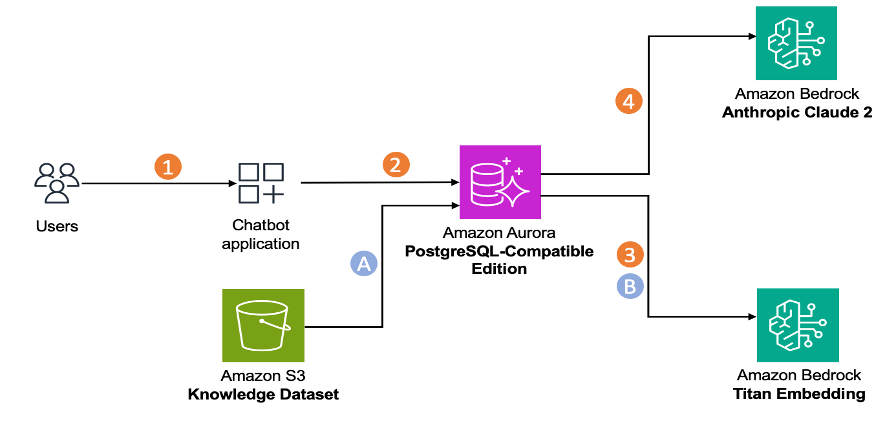
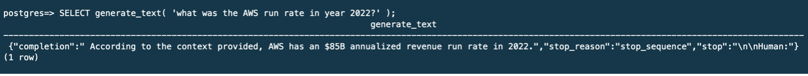

# A generative AI-powered chatbot using Amazon Aurora Machine Learning extension and Amazon Bedrock

## Introduction

[Amazon Aurora Machine Learning](https://docs.aws.amazon.com/AmazonRDS/latest/AuroraUserGuide/aurora-ml.html) (Aurora ML) enables builders to create ML-based applications using familiar SQL programming. [With recent support for Amazon Bedrock](https://aws.amazon.com/about-aws/whats-new/2023/12/amazon-aurora-postgresql-integration-bedrock-generative-ai/), Aurora ML provides access to foundational models for creating embeddings and generating text for generative AI applications directly in SQL. Now builders can create input text embeddings, perform similarity search using [pgvector](https://github.com/pgvector/pgvector), and generate text within the same Aurora SQL function. This reduces latency for text generation since document embeddings are in the same table as the text, minimizing the need to return search data to applications. 

[Amazon Bedrock](https://aws.amazon.com/bedrock/) is a fully managed service that offers a choice of high-performing foundation models (FMs) from leading AI companies like AI21 Labs, Anthropic, Cohere, Meta, Stability AI, and Amazon via a single API, along with a broad set of capabilities to help you build generative AI applications.

In this example, we demonstrate how to build an AI-powered chatbot with Aurora ML and Amazon Bedrock.


## Architecture



## Dependencies and Installation

Use the following steps to configure the environment:

1. Create S3 bucket and setup Aurora PostgreSQL 15.5 DB cluster.

2. Upload your knowledge dataset to the S3 bucket

3. Make sure you have Cloud9 environment and then make sure you have necessary permissions to call Aurora PostgreSQL from Cloud9 environment. 

4. Create a new [virtual environment](https://docs.python.org/3/library/venv.html#module-venv) and launch it.

```
python3.9 -m venv env
source env/bin/activate
```
5. You need to clone the GitHub repository to your local machine. Open a terminal window in your Cloud9 and run the following command. Note this is one single git clone command.

```
git clone https://github.com/aws-samples/aurora-postgresql-pgvector.git
cd aurora-postgresql-pgvector/05_AuroraML_Bedrock_Chatbot
```

6. Install the required dependencies by running the following command:

```
pip install -r requirements.txt
```

7. Configure environment variables used during the creation of the S3 bucket and Aurora PostgreSQL DB cluster. The below configurations are for demonstration only. For your production environment, refer [Security best practices](https://docs.aws.amazon.com/AmazonRDS/latest/AuroraUserGuide/CHAP_BestPractices.Security.html) for Aurora to securely configure your credentials.

Create a `.env` file in your project directory similar to `env.example`. Your .env file should look like the following:

```
POSTGRESQL_ENDPOINT="auroraml-bedrock-1.cluster-XXXXXX.us-east-1.rds.amazonaws.com"
POSTGRESQL_PORT="5432"
POSTGRESQL_USER="<username>"
POSTGRESQL_PW="<password>"
POSTGRESQL_DBNAME="<dbname>"
REGION=<aws-region-id>
SOURCE_S3_BUCKET="<knowledge-dataset-bucket-name>"
```

## Usage

Use the following steps to run the chatbot:

1. Configure Aurora PostgreSQL pgvector and aws_ml extensions, and a database table

`python chatbot.py --configure`

2. Ingest your knowledge dataset into Aurora PostgreSQL database

`python chatbot.py --ingest`

3. Run chatbot. Use one of the following option to run chatbot.

**Command line mode**
<!-- -->
`python chatbot.py`

**PSQL client**
<!-- -->
Connect to Aurora PostgreSQL using psql client and execute the below command to ask a question and receive a response

`postgres=> SELECT generate_text( 'What was the AWS run rate in year 2022?' )`


<!-- -->
**UI mode**
<!-- -->
`streamlit run chatbot-app.py --server.port 8080`

The above configuration to open port 8080 is for demonstration only. For your production environment, refer AWS [security best practices](https://docs.aws.amazon.com/wellarchitected/latest/security-pillar/protecting-data-in-transit.html) to securely expose your application.

4. Cleanup your resources

<!-- -->
`python chatbot.py --cleanup`
