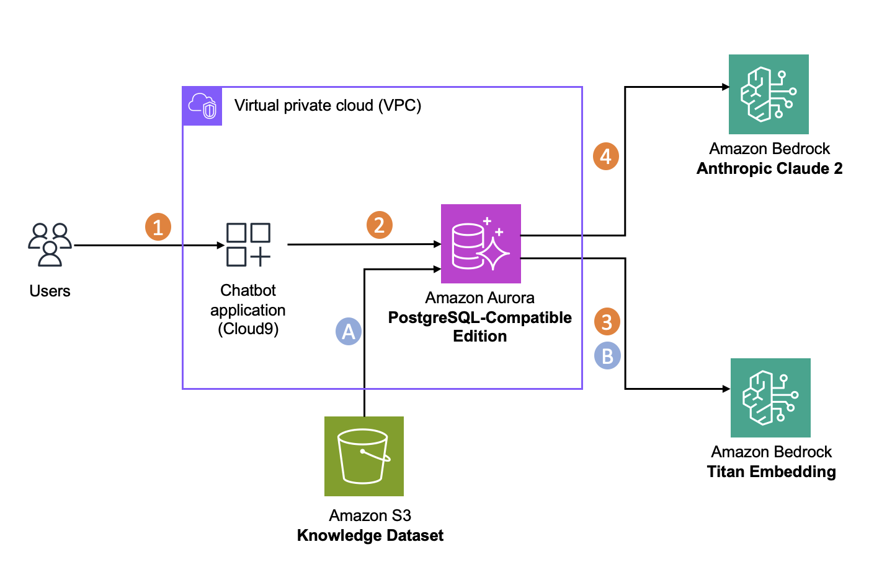

# Building an Intelligent Chatbot with Aurora ML and Amazon Bedrock

Welcome to this guide on creating a sophisticated chatbot that leverages Amazon Aurora Machine Learning and Amazon Bedrock. The system demonstrates how to build an AI-powered conversation engine that operates directly within your database environment, reducing latency and improving response times.

## Understanding the Technology

Amazon Aurora Machine Learning brings machine learning directly into your database operations through SQL commands. This integration with Amazon Bedrock provides access to foundation models, allowing you to:

- Generate text embeddings for semantic understanding (Titan Embeddings V2, 1024 dimensions)
- Perform similarity searches using pgvector with an HNSW cosine index
- Create natural language responses using Claude Sonnet (via Aurora ML's `aws_bedrock.invoke_model`)

All inference runs inside Aurora via the `aws_ml` extension, minimising data movement between services.

## Architecture



## Infrastructure Prerequisites

Complete these steps before running the application.

### 1. Create an S3 bucket for your knowledge dataset

```bash
export AWS_REGION="${AWS_REGION:-us-west-2}"
export KNOWLEDGE_BUCKET="aurora-ml-chatbot-docs-$(aws sts get-caller-identity --query Account --output text)"
aws s3 mb "s3://${KNOWLEDGE_BUCKET}" --region "${AWS_REGION}"
```

Upload PDFs to the bucket. The example query in the CLI ("What was the AWS run rate in year 2022?") assumes you have uploaded the Amazon Annual Report PDF. Any PDFs from the repository's `/data` directory also work.

```bash
# Example: upload all PDFs from the repo data directory
aws s3 cp /path/to/aurora-postgresql-pgvector/data/ "s3://${KNOWLEDGE_BUCKET}/" --recursive --exclude "*" --include "*.pdf"
```

### 2. Create an Aurora PostgreSQL 18.3 cluster

Create an Aurora PostgreSQL cluster running version 18.3 (the latest Aurora PostgreSQL major version). Enable the **Data API** if you want to run ad-hoc SQL via the console, and place the cluster in a VPC your development machine or Cloud Shell session can reach.

Note the cluster endpoint, port (default 5432), master username, password, and database name — you will need these for `.env`.

### 3. Enable Aurora ML (Bedrock integration)

Aurora ML uses an IAM role to call Bedrock on the cluster's behalf.

**Create the IAM role:**

```bash
# Create trust policy
cat > /tmp/aurora-trust.json <<'EOF'
{
  "Version": "2012-10-17",
  "Statement": [{
    "Effect": "Allow",
    "Principal": {"Service": "rds.amazonaws.com"},
    "Action": "sts:AssumeRole"
  }]
}
EOF

# Create role and attach Bedrock invoke permission
ROLE_ARN=$(aws iam create-role \
  --role-name AuroraMLBedrockRole \
  --assume-role-policy-document file:///tmp/aurora-trust.json \
  --query Role.Arn --output text)

aws iam attach-role-policy \
  --role-name AuroraMLBedrockRole \
  --policy-arn arn:aws:iam::aws:policy/AmazonBedrockFullAccess
```

> For least-privilege, replace `AmazonBedrockFullAccess` with a custom policy that allows `bedrock:InvokeModel` on the model ARNs used by this lab.

**Associate the role with your cluster** (replace `<cluster-id>` with your cluster identifier):

```bash
aws rds add-role-to-db-cluster \
  --db-cluster-identifier <cluster-id> \
  --role-arn "${ROLE_ARN}" \
  --feature-name Bedrock \
  --region "${AWS_REGION}"
```

Wait for the cluster to reflect the role (status becomes `active` in the console or via `describe-db-clusters`).

**Set the `aws_bedrock.bedrock_role` parameter** in your cluster parameter group to the role ARN above, then reboot the cluster (or let the next maintenance window apply it).

### 4. Enable Bedrock model access

Open the [Amazon Bedrock console](https://console.aws.amazon.com/bedrock/home#/modelaccess) in your region and request access to:

- **Amazon Titan Embeddings V2** (`amazon.titan-embed-text-v2:0`)
- **Anthropic Claude Sonnet 5** — select the cross-region inference profile `global.anthropic.claude-sonnet-5` (the global profile routes requests across regions automatically)

To use the latest model, you may also enable `global.anthropic.claude-sonnet-5`.

### 5. Install extensions in your database

Connect to the Aurora cluster (psql, DBeaver, or AWS CloudShell Query Editor) and run:

```sql
CREATE EXTENSION IF NOT EXISTS aws_ml CASCADE;
CREATE EXTENSION IF NOT EXISTS vector;
```

`aws_ml CASCADE` also installs `aws_bedrock` and `aws_sagemaker` sub-extensions.

## Setting Up Your Development Environment

This lab runs from any machine that can reach your Aurora cluster. Options:

- **VS Code** (local or Remote SSH) — install the Python extension and open the `07-aurora-ml-chatbot` folder.
- **AWS CloudShell** — available directly in the AWS Console; no extra setup needed.
- **Workshop Studio Code Editor** — pre-configured if you are running this as a guided workshop.

> AWS Cloud9 is no longer recommended; it reached end-of-life for new environment creation.

### Clone and install

```bash
git clone https://github.com/aws-samples/aurora-postgresql-pgvector.git
cd aurora-postgresql-pgvector/07-aurora-ml-chatbot

python3.11 -m venv env
source env/bin/activate
pip install -r requirements.txt
```

### Configuration

Copy `env.example` to `.env` and fill in your values. **Replace every angle-bracket placeholder** — they are not valid as-is.

```bash
cp env.example .env
# Edit .env with your actual values
```

Key variables:

| Variable | Description |
|---|---|
| `POSTGRESQL_ENDPOINT` | Aurora cluster writer endpoint |
| `POSTGRESQL_PORT` | Default `5432` |
| `POSTGRESQL_USER` | Master username |
| `POSTGRESQL_PW` | Master password |
| `POSTGRESQL_DBNAME` | Database name |
| `REGION` | AWS region (e.g. `us-west-2`) |
| `SOURCE_S3_BUCKET` | Bucket name containing your PDF knowledge base |
| `BEDROCK_MODEL_ID` | Generation model — default `global.anthropic.claude-sonnet-5`; override with `global.anthropic.claude-sonnet-5` for the latest |
| `EMBEDDING_MODEL_ID` | Embeddings model — default `amazon.titan-embed-text-v2:0` (1024 dimensions) |

## Running the Chatbot

### 1. Configure the database

```bash
python chatbot.py --configure
```

This creates the `aws_ml` and `vector` extensions, the `auroraml_chatbot` table with a `vector(1024)` column, an HNSW cosine index, and the `generate_embeddings` stored procedure and `generate_text` function.

### 2. Ingest your knowledge base

```bash
python chatbot.py --ingest
```

Downloads all PDFs from your S3 bucket, splits them into chunks, inserts them into the database, and calls the Aurora ML embedding procedure to populate the `embedding` column via Bedrock.

### 3. Interact with the chatbot

**Command line:**

```bash
python chatbot.py
```

Example question (requires the Amazon Annual Report PDF in your bucket):

```
What was the AWS run rate in year 2022?
```

**Direct SQL (psql or any PostgreSQL client):**

```sql
SELECT generate_text('What was the AWS run rate in year 2022?');
```

**Streamlit web interface:**

```bash
streamlit run chatbot-app.py --server.port 8080
```

### 4. Clean up resources

```bash
python chatbot.py --cleanup
```

Drops the table, stored procedure, function, and extensions.

## How It Works

1. A user question is converted to a 1024-dimension embedding by Titan Embeddings V2 (via `aws_bedrock.invoke_model_get_embeddings` inside Aurora).
2. The HNSW index performs a cosine-distance search (`<=>` operator) against all stored chunk embeddings to retrieve the most relevant context.
3. The context and question are assembled into a prompt, and `aws_bedrock.invoke_model` calls Claude Sonnet to generate a grounded answer — all within a single PostgreSQL function call.

## Security Considerations

- Store credentials in AWS Secrets Manager rather than in `.env` for production workloads.
- Scope the Aurora ML IAM role to only the specific Bedrock model ARNs this lab uses.
- Configure Aurora to use SSL (`POSTGRESQL_SSLROOTCERT` env var is supported by chatbot.py).
- Follow the principle of least privilege for database users.

## Learning Resources

- [Aurora ML documentation](https://docs.aws.amazon.com/AmazonRDS/latest/AuroraUserGuide/aurora-ml.html)
- [Amazon Bedrock](https://aws.amazon.com/bedrock/)
- [pgvector](https://github.com/pgvector/pgvector)
- [Titan Embeddings V2 model card](https://docs.aws.amazon.com/bedrock/latest/userguide/titan-embedding-models.html)
