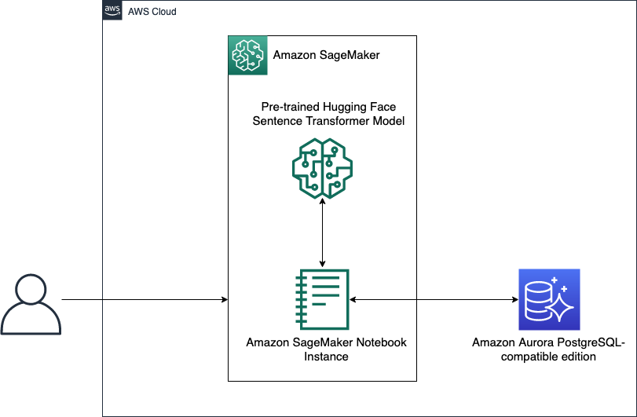

# Build an Interactive Question Answering App with pgvector on Aurora PostgreSQL

This repository guides users through building an enhanced similarity search solution using Amazon SageMaker and Amazon Aurora PostgreSQL-compatible edition using the extension `pgvector`.

# How does it work?

We have used pre-trained model [`all-mpnet-base-v2`](https://huggingface.co/sentence-transformers/all-mpnet-base-v2) from Hugging Face SentenceTransformers to generate fixed 768 length sentence embedding for the [`Aurora User Guide`](https://docs.aws.amazon.com/AmazonRDS/latest/AuroraUserGuide/CHAP_AuroraOverview.html). Then those feature vectors are stored in [Amazon Aurora PostgreSQL-compatible edition](https://docs.aws.amazon.com/AmazonRDS/latest/AuroraUserGuide/Aurora.AuroraPostgreSQL.html) using extension `pgvector` for similarity search.

# What is `pgvector`?

pgvector is an open-source extension designed to augment PostgreSQL databases with the capability to store and conduct searches on ML-generated embeddings to identify both exact and approximate nearest neighbors. It’s designed to work seamlessly with other PostgreSQL features, including indexing and querying. 

To generate vector embeddings, you can use ML service such as [Amazon SageMaker](https://aws.amazon.com/sagemaker/) or [Amazon Bedrock](https://aws.amazon.com/bedrock/) (limited preview). SageMaker allows you to easily train and deploy machine learning models, including models that generate vector embeddings for text data.

By utilizing the pgvector extension, PostgreSQL can effectively perform similarity searches on extensive vector embeddings, providing businesses with a speedy and proficient solution. 

Please review pgvector [documentation](https://github.com/pgvector/pgvector) for additional details.

# Solution

## Security

See [CONTRIBUTING](CONTRIBUTING.md#security-issue-notifications) for more information.

## License

This library is licensed under the MIT-0 License. See the LICENSE file.
