<div align="center">

# 🚀 Agentic AI, RAG & Vector Search with Aurora PostgreSQL

### Build Intelligent AI Applications with Vector Search, RAG, and Agentic Workflows

[](https://www.python.org/downloads/)
[](https://github.com/pgvector/pgvector)
[](https://aws.amazon.com/rds/aurora/)
[](https://aws.amazon.com/bedrock/)
[](https://spdx.org/licenses/MIT-0.html)

[](https://github.com/aws-samples/aurora-postgresql-pgvector/stargazers)
[](https://github.com/aws-samples/aurora-postgresql-pgvector/network)

---

**[📚 Workshop](https://catalog.workshops.aws/pgvector/en-US)** • 
**[📖 Documentation](https://awslabs.github.io/mcp/servers/postgres-mcp-server/)** • 
**[🔧 MCP Servers](https://github.com/awslabs/mcp)** • 
**[💬 Discussions](https://github.com/aws-samples/aurora-postgresql-pgvector/discussions)**

---

</div>

## 🎯 About

Discover enterprise-ready **Generative AI use cases** powered by **pgvector**, **Amazon Aurora PostgreSQL**, **Amazon Bedrock**, and **AWS Model Context Protocol (MCP)** servers. This repository showcases semantic search, RAG architectures, autonomous agents, and enterprise AI solutions—all built on a robust vector database foundation.

**What You'll Build:**
- 🔍 **Semantic Search** with vector embeddings and similarity algorithms
- 🤖 **RAG Applications** for accurate, context-aware responses
- 🎭 **Agentic Workflows** with Bedrock Agents and MCP for autonomous operations
- 🎯 **Personalized Recommendations** using hybrid search techniques
- 🏢 **Enterprise AI Solutions** with knowledge bases and compliance

---

## 🌟 Key Features

<table>
<tr>
<td width="50%">

### 🔥 Latest Technologies
- **pgvector 0.8.0+** with HNSW indexing
- **Amazon Bedrock** foundation models
- **MCP Servers** for AI-database interaction
- **Bedrock Agents** for autonomous workflows
- Multi-modal embeddings support

</td>
<td width="50%">

### ⚡ Production-Ready
- Vector dimensions up to 16,000
- Hybrid search capabilities
- Streaming RAG responses
- Enterprise-grade security
- Auto-scaling infrastructure

</td>
</tr>
</table>

---

## 🎓 Learning Paths

```mermaid
graph LR
    A[🌱 Beginner] --> B[Semantic Search]
    B --> C[Product Recommendations]
    C --> D[RAG Chatbot]
    D --> E[🚀 Intermediate]
    E --> F[Amazon Q Integration]
    E --> G[Knowledge Bases]
    F --> H[🔴 Advanced]
    G --> H
    H --> I[Blaize Bazaar]
    H --> J[Incident Detection]
    J --> K[MCP Servers]
```

<div align="center">



</div>

### 🗺️ Choose Your Path

| Level | Path | Duration |
|-------|------|----------|
| **🌱 Beginners** | Semantic Search → Product Recommendations → RAG | 2-3 hours |
| **🚀 Intermediate** | Amazon Q → Knowledge Bases → Movie Recommendations | 2-3 hours |
| **🔴 Advanced** | Blaize Bazaar → Incident Detection → MCP Integration | 3-4 hours |

---

## 📚 Use Cases & Labs

### 🎯 Core Implementations

<table>
<tr>
<th width="30%">Module</th>
<th width="15%">Duration</th>
<th width="15%">Level</th>
<th width="40%">What You'll Learn</th>
</tr>

<tr>
<td><a href="pgvector-similarity-search/"><b>🔍 Semantic Search & Sentiment Analysis</b></a></td>
<td>45 min</td>
<td>🟢 Beginner</td>
<td>Build search engines that understand meaning and analyze customer sentiment using Hugging Face models</td>
</tr>

<tr>
<td><a href="product-recommendations/"><b>🎁 Product Recommendations</b></a></td>
<td>45-60 min</td>
<td>🟢 Beginner</td>
<td>Create personalized recommendation engines with Bedrock embeddings and cosine similarity</td>
</tr>

<tr>
<td><a href="retrieval-augmented-generation/"><b>💬 Retrieval Augmented Generation (RAG)</b></a></td>
<td>45-60 min</td>
<td>🟡 Intermediate</td>
<td>Implement Q&A chatbots with accurate, grounded responses using RAG architecture</td>
</tr>

<tr>
<td><a href="text-summarization/"><b>📝 Text Summarization</b></a></td>
<td>45-60 min</td>
<td>🟡 Intermediate</td>
<td>Build automatic summarization systems for large documents with key extraction</td>
</tr>
</table>

### 🏢 Enterprise Solutions & Agents

<table>
<tr>
<th width="30%">Module</th>
<th width="15%">Duration</th>
<th width="15%">Level</th>
<th width="40%">What You'll Learn</th>
</tr>

<tr>
<td><a href="amazon-q-business/"><b>🤖 Amazon Q Business Integration</b></a></td>
<td>45-60 min</td>
<td>🟡 Intermediate</td>
<td>Deploy AI-powered data exploration platforms for healthcare data democratization</td>
</tr>

<tr>
<td><a href="movie-recommendations/"><b>🎬 Aurora ML + Bedrock Movies</b></a></td>
<td>45-60 min</td>
<td>🟡 Intermediate</td>
<td>Build Netflix-style recommendation systems using the <code>aws_ml</code> extension</td>
</tr>

<tr>
<td><a href="knowledge-bases/"><b>📚 Bedrock Knowledge Bases</b></a></td>
<td>45-60 min</td>
<td>🟡 Intermediate</td>
<td>Create enterprise knowledge bases for financial documents with regulatory compliance</td>
</tr>

<tr>
<td><a href="blaize-bazaar/"><b>🛒 Blaize Bazaar E-commerce</b></a></td>
<td>45-60 min</td>
<td>🔴 Advanced</td>
<td>Deploy complete e-commerce platforms with AI-powered search and recommendations</td>
</tr>

<tr>
<td><a href="incident-detection/"><b>🚨 Incident Detection & Remediation</b></a></td>
<td>45-60 min</td>
<td>🔴 Advanced</td>
<td>Implement intelligent monitoring with agentic workflows and auto-remediation via MCP</td>
</tr>
</table>

---

## 🚀 Quick Start

### Option 1: AWS Workshop Studio (Recommended)

<div align="center">

**[🎓 Launch Interactive Workshop](https://catalog.workshops.aws/pgvector/en-US)**

*Pre-configured environment with all dependencies ready to go*

</div>

### Option 2: Self-Paced Deployment

```bash
# Clone the repository
git clone https://github.com/aws-samples/aurora-postgresql-pgvector.git
cd aurora-postgresql-pgvector

# Deploy infrastructure using CloudFormation
aws cloudformation create-stack \
  --stack-name pgvector-workshop \
  --template-body file://cloudformation/genai-pgvector-lab.yml \
  --capabilities CAPABILITY_IAM

# Monitor deployment (takes ~15-20 minutes)
aws cloudformation wait stack-create-complete \
  --stack-name pgvector-workshop
```

### Prerequisites

- ✅ AWS account with appropriate permissions
- ✅ Basic knowledge of PostgreSQL and Python
- ✅ 15-30 minutes for environment setup
- ✅ AWS CLI configured (for self-paced option)

---

## 🏗️ Architecture

<div align="center">

```
┌─────────────────────────────────────────────────────────────┐
│                     Client Applications                      │
│              (Chatbots, Search, Recommendations)            │
└────────────────────┬────────────────────────────────────────┘
                     │
         ┌───────────┼───────────┐
         │           │           │
         ▼           ▼           ▼
   ┌─────────┐ ┌─────────┐ ┌──────────┐
   │ Bedrock │ │   MCP   │ │ SageMaker│
   │ Agents  │ │ Servers │ │  Models  │
   └────┬────┘ └────┬────┘ └────┬─────┘
        │           │           │
        └───────────┼───────────┘
                    │
         ┌──────────▼──────────┐
         │  Amazon Bedrock     │
         │  Foundation Models  │
         └──────────┬──────────┘
                    │
         ┌──────────▼──────────┐
         │ Aurora PostgreSQL   │
         │   with pgvector     │
         │  • Vector Storage   │
         │  • HNSW Indexing    │
         │  • Hybrid Search    │
         └─────────────────────┘
```

</div>

### Core Technologies

| Component | Purpose | Version |
|-----------|---------|---------|
| **Amazon Aurora PostgreSQL** | Vector database with pgvector | 16+ |
| **pgvector Extension** | Vector similarity search | 0.8.0+ |
| **Amazon Bedrock** | Foundation models & agents | Latest |
| **AWS MCP Servers** | AI-database interaction protocol | Latest |
| **Amazon SageMaker** | ML model hosting | Latest |

---

## 💻 Development Environment

Your pre-configured workspace includes:

- ✅ **VS Code in Browser** - No local setup required
- ✅ **Python 3.11+** with ML/AI libraries (boto3, langchain, pgvector)
- ✅ **PostgreSQL Client Tools** with pgvector extension
- ✅ **AWS CLI & SDKs** pre-authenticated
- ✅ **Jupyter Notebooks** for interactive development
- ✅ **AI Extensions** for enhanced productivity

---

## 📖 Resources

### 📚 Documentation & Guides

- 📘 [AWS Blog: Leverage pgvector for NLP, Chatbots & Sentiment Analysis](https://aws.amazon.com/blogs/database/leverage-pgvector-and-amazon-aurora-postgresql-for-natural-language-processing-chatbots-and-sentiment-analysis/)
- 🚀 [AWS Blog: Supercharging Vector Search with pgvector 0.8.0](https://aws.amazon.com/blogs/database/supercharging-vector-search-performance-and-relevance-with-pgvector-0-8-0-on-amazon-aurora-postgresql/)
- 🤖 [AWS Blog: Database Development with AWS MCP Servers](https://aws.amazon.com/blogs/database/supercharging-aws-database-development-with-aws-mcp-servers/)
- 🎓 [Complete Workshop Labs](https://catalog.workshops.aws/pgvector/en-US)
- 🔧 [PostgreSQL MCP Server Documentation](https://awslabs.github.io/mcp/servers/postgres-mcp-server/)

### 🔗 Related Projects

- [pgvector Official Repository](https://github.com/pgvector/pgvector)
- [Amazon Aurora Documentation](https://docs.aws.amazon.com/AmazonRDS/latest/AuroraUserGuide/)
- [Amazon Bedrock Samples](https://github.com/aws-samples/amazon-bedrock-samples)
- [AWS MCP Servers](https://github.com/awslabs/mcp)

---

## ⚠️ Important Notes

<table>
<tr>
<td width="33%">

### 🎓 Educational Purpose
Sample code designed for learning. Requires adaptation for production use.

</td>
<td width="33%">

### 💰 Cost Management
Running labs incurs AWS charges. Monitor usage and clean up resources.

</td>
<td width="33%">

### 🧹 Resource Cleanup
Always delete CloudFormation stacks after completing labs.

</td>
</tr>
</table>

---

## 🤝 Contributing

We welcome contributions! Please see our [Contributing Guidelines](CONTRIBUTING.md) for details.

1. Fork the repository
2. Create a feature branch (`git checkout -b feature/amazing-feature`)
3. Commit your changes (`git commit -m 'Add amazing feature'`)
4. Push to the branch (`git push origin feature/amazing-feature`)
5. Open a Pull Request

---

## 📄 License

This project is licensed under the [MIT-0 License](LICENSE) - see the LICENSE file for details.

---

<div align="center">

### 🚀 Ready to Build AI Applications?

**[Launch Workshop](https://catalog.workshops.aws/pgvector/en-US)** • 
**[View Docs](https://awslabs.github.io/mcp/servers/postgres-mcp-server/)** • 
**[Explore MCP](https://github.com/awslabs/mcp)**

---

**Made with ❤️ by AWS**

*Star ⭐ this repo if you find it helpful!*

</div>
