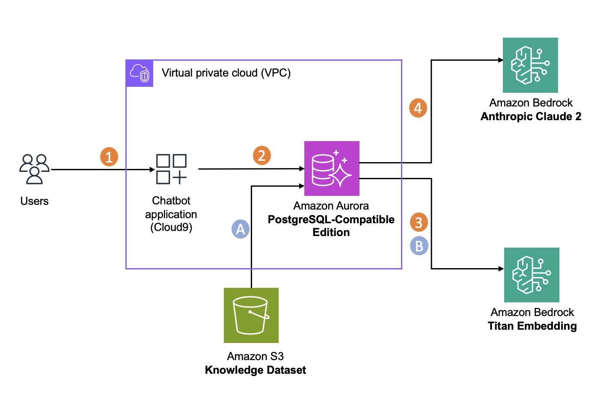

# 🤖 Building an Intelligent Chatbot with Aurora ML and Amazon Bedrock

Welcome to our guide on creating a sophisticated chatbot that leverages the power of Amazon Aurora Machine Learning and Amazon Bedrock. This system demonstrates how to build an AI-powered conversation engine that operates directly within your database environment, reducing latency and improving response times.

## Understanding the Technology

Amazon Aurora Machine Learning brings the power of machine learning directly into your database operations through SQL commands. Think of it as having an AI assistant built right into your database that can understand and process information without needing to send data back and forth to external services. This integration with Amazon Bedrock provides access to state-of-the-art foundation models, allowing you to:

- Generate text embeddings for semantic understanding
- Perform intelligent similarity searches using pgvector
- Create natural language responses using advanced language models

The system processes information within the database context, significantly reducing the time typically needed to transfer data between different services.

## 🏗️ Architecture



Our architecture demonstrates how different AWS services work together to create an intelligent chatbot system. Each component plays a crucial role in processing and understanding user queries while maintaining high performance and low latency.

## 🚀 Setting Up Your Environment

Let's walk through the setup process systematically:

### Infrastructure Prerequisites

1. Create your foundational resources:
   ```bash
   # First, create an S3 bucket for your knowledge dataset
   # Then, set up an Aurora PostgreSQL 15.5 database cluster
   ```

2. Prepare your development environment:
   ```bash
   # Set up Cloud9 with appropriate permissions
   python3.9 -m venv env
   source env/bin/activate
   ```

3. Clone the repository:
   ```bash
   git clone https://github.com/aws-samples/aurora-postgresql-pgvector.git
   cd aurora-postgresql-pgvector/05_AuroraML_Bedrock_Chatbot
   ```

4. Install dependencies:
   ```bash
   pip install -r requirements.txt
   ```

### Configuration

Create a `.env` file with your system details:
```bash
POSTGRESQL_ENDPOINT="auroraml-bedrock-1.cluster-XXXXXX.us-east-1.rds.amazonaws.com"
POSTGRESQL_PORT="5432"
POSTGRESQL_USER="username"
POSTGRESQL_PW="password"
POSTGRESQL_DBNAME="dbname"
REGION="aws-region-id"
SOURCE_S3_BUCKET="knowledge-dataset-bucket-name"
```

Note: For production environments, always follow AWS security best practices for credential management and database configuration.

## 💻 Running Your Chatbot

The system can be initialized and operated in four main steps:

### 1. System Configuration
Initialize your database environment:
```bash
python chatbot.py --configure
```
This command sets up necessary extensions and prepares your database structure.

### 2. Knowledge Integration
Load your knowledge base:
```bash
python chatbot.py --ingest
```
This step processes and stores your knowledge dataset in the database.

### 3. Interaction Modes

Choose from three ways to interact with your chatbot:

**Command Line Interface**
```bash
python chatbot.py
```
Perfect for quick testing and development.

**PostgreSQL Client**
```sql
postgres=> SELECT generate_text('What was the AWS run rate in year 2022?')
```
Ideal for direct database interaction and testing.

**Web Interface**
```bash
streamlit run chatbot-app.py --server.port 8080
```
Provides a user-friendly interface for broader accessibility.

### 4. Resource Management
Clean up when finished:
```bash
python chatbot.py --cleanup
```

## 🔍 Understanding How It Works

Your chatbot processes queries through several sophisticated steps:

1. When a user asks a question, the system converts it into a mathematical representation (embedding) that captures its meaning.
2. This embedding is used to search through your knowledge base for relevant information.
3. The matched information is then processed by foundation models to generate a natural, contextually appropriate response.
4. All of this happens within your database environment, minimizing data transfer and reducing response times.

## 🛡️ Security Considerations

For production deployments, always:
- Implement proper authentication and authorization
- Secure your database connections
- Follow AWS security best practices for data protection
- Configure appropriate network access controls

## 📚 Learning Resources

To deepen your understanding:
- Explore [Aurora ML documentation](https://docs.aws.amazon.com/AmazonRDS/latest/AuroraUserGuide/aurora-ml.html)
- Learn about [Amazon Bedrock capabilities](https://aws.amazon.com/bedrock/)
- Understand [pgvector](https://github.com/pgvector/pgvector) for similarity searches
