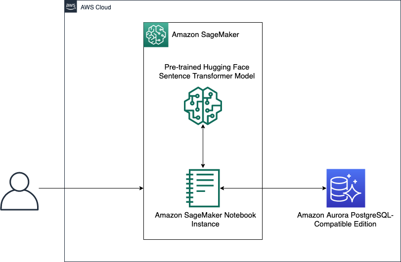

# 🔍 Understanding Customer Sentiment Through AI

Welcome to our advanced natural language processing system that combines semantic search capabilities with sentiment analysis. This solution demonstrates how to harness the power of Amazon Comprehend and Aurora PostgreSQL to gain meaningful insights from customer reviews and textual feedback.

## 🎯 What This System Does

Imagine having thousands of hotel reviews and wanting to understand not just what customers are saying, but how they feel about their experiences. Our system makes this possible by combining two powerful capabilities:

1. **Semantic Understanding**: The ability to grasp the meaning behind words, understanding that phrases like "exceptional stay" and "wonderful experience" convey similar sentiments even though they use different words.

2. **Sentiment Analysis**: The ability to detect the emotional tone in text, distinguishing between positive, negative, and neutral expressions. For example, understanding that "the room was spotless" carries positive sentiment while "the service was slow" carries negative sentiment.

## 🏗️ System Architecture



Our architecture brings together several sophisticated AWS services to create a comprehensive text analysis system:

**Core Components**:
- **Amazon Comprehend**: Acts as our sentiment analysis engine, using advanced natural language processing to understand the emotional content of text. Think of it as an expert reader who can detect subtle nuances in written expression.
- **Aurora PostgreSQL**: Serves as our intelligent database, enhanced with special capabilities for handling both traditional data and vector representations of text.
- **Aurora Machine Learning**: Provides the bridge between our database and machine learning services, allowing us to perform sentiment analysis directly through SQL queries.
- **pgvector Extension**: Enables our database to understand and compare text based on meaning rather than just exact matches.

## 🚀 Setting Up Your Environment

Let's walk through the setup process step by step:

### Initial Setup

1. First, create your working environment:
   ```bash
   # Clone this repository to your local machine
   git clone [repository-url]
   cd [repository-name]

   # Create an isolated Python environment for clean dependencies
   python3.9 -m venv env
   source env/bin/activate
   ```

2. Configure your environment by creating a `.env` file:
   ```bash
   # API access configuration
   HUGGINGFACEHUB_API_TOKEN='your-access-token'

   # Database connection details
   PGVECTOR_DRIVER='psycopg2'
   PGVECTOR_USER='your-username'
   PGVECTOR_PASSWORD='your-password'
   PGVECTOR_HOST='your-aurora-cluster-endpoint'
   PGVECTOR_PORT=5432
   PGVECTOR_DATABASE='your-database-name'
   ```

3. Install the necessary tools:
   ```bash
   pip install -r requirements.txt
   ```

### Database Setup

Your Aurora PostgreSQL database needs special capabilities for text analysis. Enable these with:

```sql
-- Enable machine learning capabilities
CREATE EXTENSION IF NOT EXISTS aws_ml CASCADE;

-- Enable vector operations for semantic search
CREATE EXTENSION IF NOT EXISTS vector;
```

## 💡 Understanding the Components

### Natural Language Processing with Amazon Comprehend

Amazon Comprehend works like a skilled linguist who can understand the subtle meanings in text. When you submit a hotel review like "The staff went above and beyond to make our stay memorable," Comprehend can:
- Identify the positive sentiment
- Recognize key phrases about service quality
- Understand contextual relationships between words

### Vector Operations with pgvector

The pgvector extension allows us to convert text into mathematical representations that capture meaning. This enables our system to understand that:
- "The room was immaculate" and "The accommodation was spotlessly clean" are very similar in meaning
- "The breakfast was cold" and "The morning meal was not served at proper temperature" express similar complaints

## 📝 Working with the Jupyter Notebook

Our `pgvector_with_langchain_auroraml.ipynb` notebook guides you through:
- Loading and processing hotel review data
- Performing sentiment analysis using Amazon Comprehend
- Implementing semantic search to find similar reviews
- Analyzing sentiment patterns across different aspects of hotel service

## 🔧 Troubleshooting Common Challenges

### Token Dimension Mismatch

If you encounter an error about token dimensions (1536 vs 768), this usually indicates a version mismatch between different embedding models. For detailed resolution steps, consult our [GitHub Issue thread](https://github.com/hwchase17/langchain/issues/2219).

## 📚 Best Practices

To get the most out of this system:
- Regularly update your model permissions and IAM roles
- Monitor sentiment analysis accuracy over time
- Consider batch processing for large volumes of reviews
- Implement error handling for various types of text input

## 🔒 Security Note

This system requires specific IAM roles and policies for Amazon Aurora to communicate with Amazon Comprehend. For detailed setup instructions, refer to our comprehensive blog post: [Leverage pgvector and Amazon Aurora PostgreSQL for Natural Language Processing, Chatbots and Sentiment Analysis](https://aws.amazon.com/blogs/database/leverage-pgvector-and-amazon-aurora-postgresql-for-natural-language-processing-chatbots-and-sentiment-analysis/).

## 📜 License

This project is released under the [MIT-0 License](https://spdx.org/licenses/MIT-0.html), allowing you to use and modify the code while maintaining attribution.
