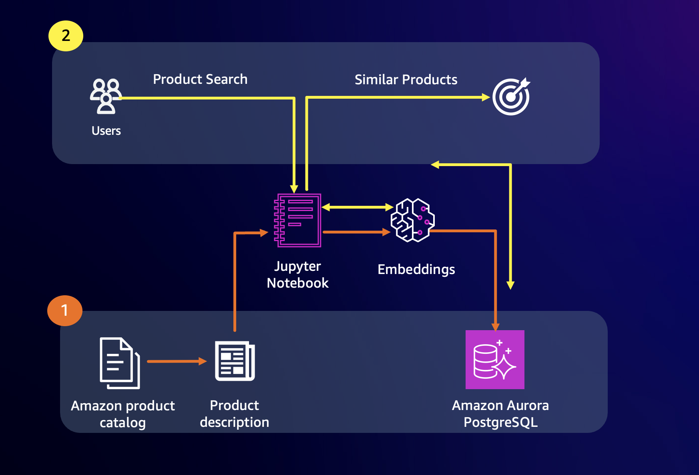

# 🛍️ Intelligent Product Recommendations Engine

Welcome to our advanced product recommendations system that harnesses the power of semantic search and natural language understanding. This solution demonstrates how to create personalized product recommendations by understanding the deeper meaning behind product descriptions using two different approaches to text embedding generation.

## 🎯 Understanding Our Approach

At its heart, this system transforms product descriptions into rich mathematical representations called embeddings. These embeddings capture the subtle nuances and semantic relationships between products in a way that allows computers to understand similarities that would be obvious to humans. For example, a "winter jacket" and "cold weather coat" might use different words, but our system understands they serve similar purposes.

We demonstrate two powerful approaches to generating these text embeddings:

### 📝 SentenceTransformers Approach

Our first approach (`genai-pgvector-similarity-search.ipynb`) utilizes the `all-MiniLM-L6-v2` model from Hugging Face's SentenceTransformers library. This method:

- Creates compact 384-dimensional embeddings that efficiently capture semantic meaning
- Works with the Zalando Research dataset containing detailed product descriptions
- Demonstrates how to implement efficient similarity search using smaller embedding sizes
- Shows how to balance computational efficiency with semantic understanding

When we say this model creates 384-dimensional embeddings, think of it as creating 384 different measurements for each product description, where each measurement captures some aspect of the product's characteristics, uses, or features.

### 🔍 Amazon Titan Text Approach

Our second approach (`bedrock-text-search.ipynb`) leverages Amazon's Titan Text model through Amazon Bedrock. This implementation:

- Generates rich 1536-dimensional embeddings that capture extremely detailed semantic relationships
- Processes a comprehensive dataset of over 9,000 Amazon product descriptions
- Shows how to implement enterprise-scale semantic search
- Demonstrates the advantages of using larger embedding spaces for more nuanced understanding

The 1536-dimensional embeddings from Titan Text can capture even more subtle relationships between products, though they require more storage space and computational resources. This trade-off between embedding size and semantic richness is an important consideration in system design.

## 🏗️ System Architecture

Our architecture integrates several powerful AWS services to create a robust recommendation system:

- **Amazon SageMaker**: Provides the computational infrastructure for processing product descriptions and generating embeddings
- **Amazon Bedrock**: Offers access to the Titan Text model for generating high-quality semantic embeddings
- **Aurora PostgreSQL with pgvector**: Enables efficient storage and similarity search of high-dimensional embeddings, whether they're the 384-dimensional SentenceTransformers vectors or the 1536-dimensional Titan Text vectors

## 🚀 Getting Started

### Prerequisites

Before diving in, ensure you have:
- An AWS account with access to SageMaker and Bedrock
- Basic familiarity with Python and Jupyter notebooks
- Aurora PostgreSQL cluster with pgvector extension enabled
- Understanding of basic natural language processing concepts

### Working with the Notebooks

1. **SentenceTransformers Implementation** (`genai-pgvector-similarity-search.ipynb`):
   This notebook walks you through:
   - Processing product descriptions from the Zalando dataset
   - Generating embeddings using the all-MiniLM-L6-v2 model
   - Storing and querying 384-dimensional embeddings in Aurora PostgreSQL
   - Creating an efficient semantic search system

2. **Amazon Titan Implementation** (`bedrock-text-search.ipynb`):
   This notebook demonstrates:
   - Processing Amazon product catalog descriptions
   - Using Amazon Titan Text for generating 1536-dimensional embeddings
   - Implementing sophisticated product search and recommendations
   - Evaluating semantic search quality

## 💡 Understanding Vector Embeddings

Text embeddings are the foundation of our system. When we convert product descriptions into embeddings, we're essentially translating human language into a format that computers can understand and compare efficiently. Each dimension in these embeddings captures some aspect of the product's characteristics.

For example, some dimensions might represent:
- Product categories and subcategories
- Intended use cases and scenarios
- Material characteristics and quality indicators
- Style and design elements
- Technical specifications
- Price range and value propositions

The key difference between our two approaches lies in how much information each can pack into their respective embedding spaces:
- The 384 dimensions of SentenceTransformers provide efficient, focused semantic understanding
- The 1536 dimensions of Titan Text allow for more nuanced and detailed semantic relationships

## 🔒 Security Considerations

Security is paramount in any recommendation system. We've implemented several best practices:
- Secure handling of product data and embeddings
- Authentication and authorization controls
- Protection of proprietary product information

For detailed security information and to report security issues, please refer to our [CONTRIBUTING](CONTRIBUTING.md#security-issue-notifications) guide.

## 📚 Best Practices

To get the most out of this recommendation system:
- Choose embedding dimensions based on your specific needs for semantic understanding versus computational efficiency
- Regularly update your product embeddings as descriptions change
- Monitor recommendation quality through user engagement metrics
- Implement A/B testing to compare the effectiveness of different embedding approaches

## 📜 License

This project is licensed under the MIT-0 License, providing you the freedom to learn from and build upon this work. See the LICENSE file for complete details.
