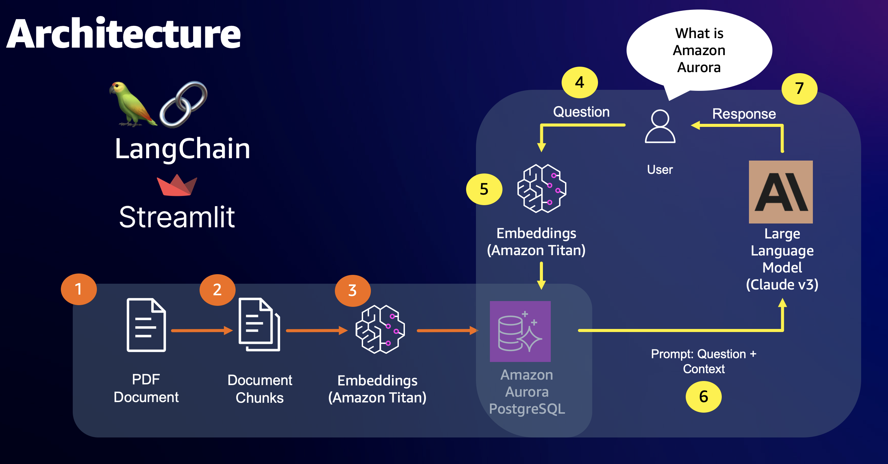

# 🤖 Enterprise RAG Question-Answering System

Build an enterprise-ready Retrieval Augmented Generation (RAG) application leveraging Amazon Web Services and open-source technologies. This implementation creates an intelligent question-answering system that combines the power of vector databases with state-of-the-art language models.

## 🎯 Overview

This solution demonstrates the implementation of a production-ready RAG system using:

- 🚀 Amazon Bedrock for accessing foundation models
- 📊 pgvector extension on Amazon Aurora PostgreSQL for vector operations
- 🧠 Anthropic's Claude for advanced language understanding
- 💫 Titan Text for generating high-quality text embeddings
- 🔗 LangChain for orchestrating AI components
- 🖥️ Streamlit for creating an intuitive user interface

## 🏗️ Architecture



## ⚙️ System Workflow

Our RAG implementation follows a sophisticated pipeline to deliver accurate answers:

1. **Document Ingestion** 📄
   - Processes PDF documents through advanced text extraction
   - Maintains document structure and metadata

2. **Semantic Processing** 🔄
   - Implements intelligent text chunking algorithms
   - Preserves context across document segments

3. **Vector Embedding** 🎯
   - Utilizes Amazon Bedrock's Titan Text for generating embeddings
   - Creates high-dimensional vector representations of content

4. **Query Processing** 💭
   - Accepts natural language questions
   - Converts queries into compatible vector representations

5. **Context Retrieval** 🔍
   - Performs semantic similarity matching
   - Identifies relevant document segments

6. **Answer Generation** ✨
   - Leverages Anthropic's Claude for response synthesis
   - Ensures responses are grounded in source documents

## 🚀 Getting Started

### Prerequisites

- Python 3.9 or higher
- AWS account with Bedrock access
- Amazon Aurora PostgreSQL cluster
- Git

### Installation

1. Clone the repository:
   ```bash
   git clone [repository-url]
   cd [repository-name]
   ```

2. Create and activate a virtual environment:
   ```bash
   python3.9 -m venv env
   source env/bin/activate
   ```

3. Configure environment variables:
   ```bash
   # Create .env file with the following structure
   PGVECTOR_DRIVER='psycopg2'
   PGVECTOR_USER='<username>'
   PGVECTOR_PASSWORD='<password>'
   PGVECTOR_HOST='<aurora-cluster-endpoint>'
   PGVECTOR_PORT=5432
   PGVECTOR_DATABASE='<database-name>'
   ```

4. Install dependencies:
   ```bash
   pip install -r requirements.txt
   ```

### Database Setup

1. Connect to your Aurora PostgreSQL cluster
2. Enable the pgvector extension:
   ```sql
   CREATE EXTENSION vector;
   ```

## 💻 Usage

1. Launch the application:
   ```bash
   streamlit run app.py
   ```

2. Navigate to the web interface in your browser
3. Upload PDF documents through the provided interface
4. Start asking questions about your documents

## 🔒 Security Considerations

- Implement appropriate IAM roles and permissions
- Secure database connections using SSL/TLS
- Follow AWS security best practices for Bedrock access
- Properly handle sensitive information in environment variables

## 📈 Performance Optimization

- Utilize connection pooling for database operations
- Implement caching strategies where appropriate
- Configure proper chunk sizes for optimal retrieval
- Monitor and adjust embedding dimensions based on requirements

## 🤝 Contributing

This project is maintained for educational purposes and demonstrates AWS best practices. While we don't accept direct contributions, we encourage:

- Creating issues for bugs or suggested improvements
- Forking the repository for personal customization
- Sharing your experiences and optimizations

## 📝 License

This project is licensed under the [MIT-0 License](https://spdx.org/licenses/MIT-0.html) - see the LICENSE file for details.
