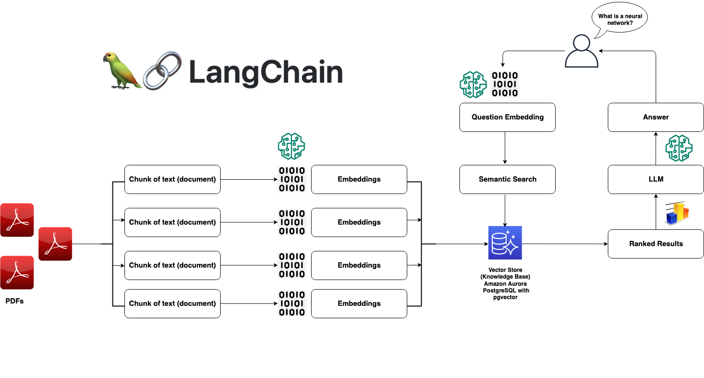

# 🤖 Intelligent Document Question-Answering System

Welcome to our advanced Question-Answering application that harnesses the power of Retrieval Augmented Generation (RAG), pgvector, Aurora PostgreSQL, and Hugging Face technologies. This system enables natural language interactions with your PDF documents, providing precise answers drawn directly from your document collection.

## 💡 Key Features

This application brings together several powerful technologies to create an intelligent document analysis system:

- Natural language question answering for PDF documents
- Semantic search capabilities using vector embeddings
- Scalable document processing with Aurora PostgreSQL
- Integration with state-of-the-art Hugging Face language models
- User-friendly interface built with Streamlit

## 🏗️ Architecture



## 🔄 System Workflow

Our application processes your documents and questions through a sophisticated pipeline:

1. **Document Processing Engine** 📚
   The system begins by carefully extracting text content from your PDF documents, maintaining the structural integrity and relationships within the content.

2. **Intelligent Text Segmentation** ✂️
   The extracted text undergoes smart segmentation, breaking down the content into optimally-sized chunks that preserve context and meaning. This process ensures that we maintain the semantic relationships within your documents.

3. **Neural Embedding Generation** 🧠
   Each text segment is transformed into a high-dimensional vector representation using advanced language models from Hugging Face. These embeddings capture the deep semantic meaning of your content.

4. **Context-Aware Search** 🔍
   When you pose a question, our system compares it against the entire document collection, identifying the most semantically relevant content through sophisticated vector similarity calculations.

5. **AI-Powered Response Generation** ✨
   The system synthesizes answers using selected relevant content, ensuring responses are accurate and grounded in your documents.

## 🚀 Getting Started

### System Requirements

- Python 3.9 or higher
- PostgreSQL 14 or higher with pgvector extension
- Hugging Face account with API access
- Sufficient storage for document processing

### Installation Process

1. Set up your local development environment:
   ```bash
   # Clone the repository
   git clone [repository-url]
   cd [repository-name]

   # Create and activate virtual environment
   python3.9 -m venv env
   source env/bin/activate
   ```

2. Configure your environment variables:
   ```bash
   # Create a .env file with the following configuration
   HUGGINGFACEHUB_API_TOKEN='your-api-token'

   PGVECTOR_DRIVER='psycopg2'
   PGVECTOR_USER='your-username'
   PGVECTOR_PASSWORD='your-password'
   PGVECTOR_HOST='your-aurora-cluster-endpoint'
   PGVECTOR_PORT=5432
   PGVECTOR_DATABASE='your-database-name'
   ```

3. Install required packages:
   ```bash
   pip install -r requirements.txt
   ```

### Database Configuration

Before running the application, set up your database environment:

1. Connect to your Aurora PostgreSQL cluster
2. Enable vector operations:
   ```sql
   CREATE EXTENSION vector;
   ```

## 💻 Running the Application

Launch the application using Streamlit:
```bash
streamlit run app.py
```

The system will guide you through:
1. Uploading your PDF documents
2. Processing and indexing the content
3. Asking questions about your documents

## 🔧 Troubleshooting

### Token Dimension Mismatch

If you encounter an error related to token dimension mismatch (1536 vs 768), this typically indicates a version compatibility issue between model embeddings. Please refer to our detailed troubleshooting guide in the [GitHub Issue thread](https://github.com/hwchase17/langchain/issues/2219) for resolution steps.

## 🛡️ Best Practices

To get the most out of this application:

- Ensure your PDF documents are text-searchable
- Monitor your Hugging Face API token usage
- Regularly backup your vector database
- Test with smaller document sets before processing large collections

## 🤝 Community and Contributing

While this repository serves educational purposes and doesn't accept direct contributions, we encourage you to:

- Study the implementation patterns
- Adapt the code for your specific use cases
- Share your learnings with the community

## 📜 License

This project is licensed under the [MIT-0 License](https://spdx.org/licenses/MIT-0.html), allowing you to use, modify, and distribute the code freely while maintaining attribution.
