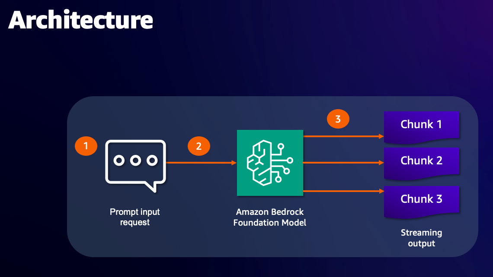

# 🤖 Real-Time Document Intelligence System

Welcome to our advanced Question-Answering system that implements Retrieval Augmented Generation (RAG) with streaming capabilities. This application represents a sophisticated approach to document interaction, combining the power of vector databases, large language models, and real-time response streaming to create an engaging and responsive experience.

## 💡 Understanding Our System

At its core, this application transforms the way you interact with PDF documents. Think of it as having a knowledgeable assistant who has read and understood all your documents, can answer questions about them instantly, and delivers responses in a natural, flowing manner – similar to how a person would explain something in conversation.

The streaming capability means you'll see answers form in real-time, word by word, rather than waiting for complete responses. This creates a more interactive and engaging experience, allowing you to process information gradually and naturally.

## 🏗️ Architecture



## 🔄 How Information Flows Through Our System

Let's walk through how your documents transform into intelligent, streaming responses:

1. **Document Understanding** 📚
   Your PDF documents undergo a careful reading process, much like how a person would read and understand text. The system extracts not just the words, but maintains the structural relationships and context within your documents.

2. **Smart Content Organization** 📋
   The extracted information is thoughtfully divided into meaningful segments. Think of this as creating a well-organized set of notes where each section maintains its context and relevance. This organization is crucial for quick and accurate retrieval later.

3. **Creating Document Memory** 🧠
   Each segment of text is transformed into a mathematical representation using advanced language models. These representations capture the deep meaning of your content, allowing the system to understand relationships between different parts of your documents.

4. **Intelligent Search Process** 🔍
   When you ask a question, the system performs a sophisticated matching process, finding the most relevant pieces of information from your documents. This is similar to how a human expert would recall relevant information to answer your question.

5. **Real-Time Response Generation** ⚡
   The system crafts responses using the retrieved information, delivering them word by word in a streaming fashion. This creates a natural dialogue experience, similar to having a conversation with someone who is thinking and responding in real-time.

## 🚀 Setting Up Your Environment

Let's walk through the setup process step by step:

### Prerequisites

Before we begin, ensure you have:
- Python 3.9 or higher installed on your system
- Access to an Aurora PostgreSQL database
- Basic familiarity with command line operations
- Adequate storage space for document processing

### Installation Steps

1. First, let's create a dedicated space for our application:
   ```bash
   # Clone this knowledge base to your local machine
   git clone [repository-url]
   cd [repository-name]

   # Create an isolated Python environment
   python3.9 -m venv env
   source env/bin/activate
   ```

2. Now, we'll set up our configuration. Create a `.env` file with your credentials:
   ```bash
   # Essential configuration values for your application
   HUGGINGFACEHUB_API_TOKEN='your-api-token'

   # Database connection details
   PGVECTOR_DRIVER='psycopg2'
   PGVECTOR_USER='your-username'
   PGVECTOR_PASSWORD='your-password'
   PGVECTOR_HOST='your-aurora-cluster-endpoint'
   PGVECTOR_PORT=5432
   PGVECTOR_DATABASE='your-database-name'
   ```

3. Install the tools our system needs:
   ```bash
   pip install -r requirements.txt
   ```

### Database Preparation

Before running the application, we need to enable vector operations in your database:

1. Connect to your Aurora PostgreSQL cluster
2. Enable the vector extension:
   ```sql
   CREATE EXTENSION vector;
   ```

## 💻 Bringing Your System to Life

Starting the application is straightforward:
```bash
streamlit run app.py
```

The system will guide you through three main phases:
1. Document upload: Share your PDF documents with the system
2. Processing: Watch as your documents are analyzed and organized
3. Interaction: Begin asking questions and receive streaming responses

## 🔧 Solving Common Challenges

### Understanding Token Dimension Mismatches

If you encounter an error about token dimensions (1536 vs 768), this indicates a mismatch between different model versions in your system. This is similar to trying to fit a puzzle piece from one set into another - the dimensions need to match. You can find detailed resolution steps in our [GitHub Issue thread](https://github.com/hwchase17/langchain/issues/2219).

## 📚 Best Practices for Optimal Results

To get the most out of your document intelligence system:

Remember that the system's knowledge is bounded by your uploaded documents. It understands and answers questions based solely on the content you provide, much like a human expert who has read only those specific documents.

Think of your questions as conversations with someone who has thoroughly read your documents. The more specific and clear your questions, the more precise the answers will be.

## 🤝 Learning and Growing Together

While this repository serves primarily educational purposes and doesn't accept direct contributions, we encourage you to explore and adapt the code for your specific needs. Think of it as a foundation upon which you can build your own innovations.

## 📜 License

This project operates under the [MIT-0 License](https://spdx.org/licenses/MIT-0.html), giving you the freedom to learn from, modify, and build upon this work while maintaining attribution to the original creators.
